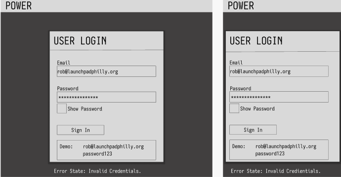
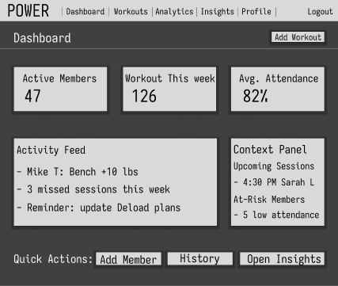
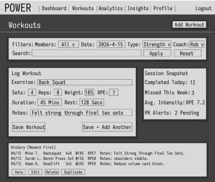
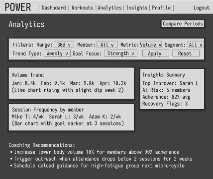
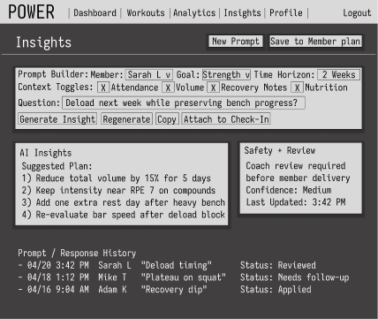

Core Project Goal: build a gym-owner app with login, member workout tracking, analytics, AI integration, testing, and Docker support
Bonus Goal: introduce a guided path for AWS EC2 deployment using GitHub Actions without breaking the core pacing

## Business Problem Statement

Independent gym owners often track member workouts across scattered notes, text messages, and spreadsheets, which makes coaching quality inconsistent and progress hard to measure. Without a centralized system, owners lose time on admin work and miss opportunities to retain members through data-driven programming. This matters because member churn directly impacts gym revenue and growth. Power solves this by giving gym owners one place to log workouts, review analytics, and generate AI-assisted coaching insights.

## Wireframe


[Screen 1: Login]


[Screen 2: Dashboard]


[Screen 3: Workouts]


[Screen 4: Analytics]


[Screen 5: AI Insights]


[Shared Interaction Notes]
- Login success -> Dashboard
- Dashboard quick action "Add Workout" -> Workouts with form focused
- Workouts save -> success toast + history refresh
- Analytics with no data -> empty card "Log workouts to see trends"
- AI request loading -> skeleton response panel + retry on error

```
[Mobile Layout Snapshot]
+--------------------------------------+
| [=] Power              [Profile]     |
|--------------------------------------|
| Page Title                             |
| KPI Card 1                             |
| KPI Card 2                             |
| KPI Card 3                             |
| Activity Feed                          |
| [Primary Action Button]                |
|--------------------------------------|
| Nav: Dashboard | Workouts | Analytics |
+--------------------------------------+
```

Week 1: Deliverables
- business problem statement
- feature list
- Wireframe
- starter project running locally
- starter Docker setup
- draft Prisma schema plan

Week 2: Deliverables
Monday
- gym-owner problem statement refined 
  - 3–5 sentences
  - identifies the main user
  - explains the real business problem
  - explains why the problem matters

- app purpose statement added to problem statement
  - 1–2 sentences
  - explains how the app will solve the problem for the gym owner

- required feature list in GitHub repo 
  - login
  - member workout tracking
  - analytics
  - AI feature

- must-have vs nice-to-have feature list
- user journey draft
  - basic flow from login to dashboard to workout tracking to analytics to AI


Tuesday
- Login page -> rob@launchpadphilly.org password123
- Dashboard page
- Workout placeholder
- Analytics placeholder
- AI placeholder
- clean folder structure
- peer review notes

---

## Week 1 Setup

### Tech Stack
- **Next.js 14+** with TypeScript and React 18
- **Prisma 7** with PostgreSQL
- **TailwindCSS** for styling
- **Framer Motion** for animations
- **Docker** for containerization

### Local Development

#### Prerequisites
- Node.js 20+ (or use Docker)
- PostgreSQL 16+ (or use Docker Compose)

#### Option 1: Local Setup (without Docker)
```bash
# 1. Install dependencies
npm install

# 2. Set up environment
cp .env.example .env.local
# Update DATABASE_URL if using local PostgreSQL

# 3. Generate Prisma Client
npm run prisma:generate

# 4. Run migrations (requires PostgreSQL running)
npm run prisma:migrate

# 5. Start dev server
npm run dev
```

#### Option 2: Docker Compose (Recommended)
```bash
# Start app + PostgreSQL
docker compose up

# On first run, run migrations in a separate terminal:
docker compose exec app npm run prisma:migrate
```

The app will be available at **http://localhost:3000**

#### Demo Login
- Email: `rob@launchpadphilly.org`
- Password: `password123`

### Project Structure
```
app/              # Next.js App Router pages
├── (auth)/       # Authentication routes
├── dashboard/    # Dashboard page
├── workouts/     # Workouts page
├── analytics/    # Analytics page
└── ai/           # AI feature page

components/       # Reusable React components
lib/              # Utilities, Prisma client, helpers
prisma/           # Prisma schema & migrations
```

### Database Schema (Draft)
- **User**: Gym owners and members
- **Member**: Members under a gym owner
- **Workout**: Workout records per member
- **Session**: User sessions for authentication

See `prisma/schema.prisma` for full schema.
